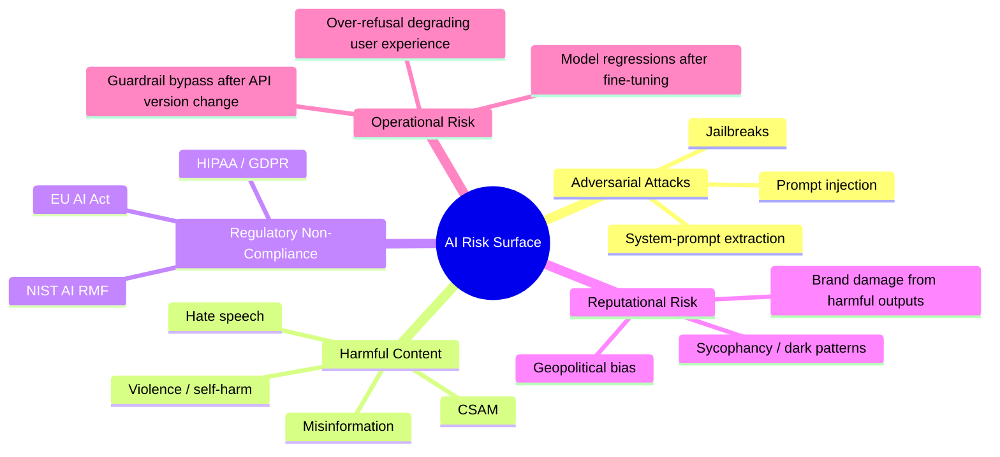
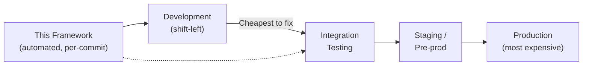
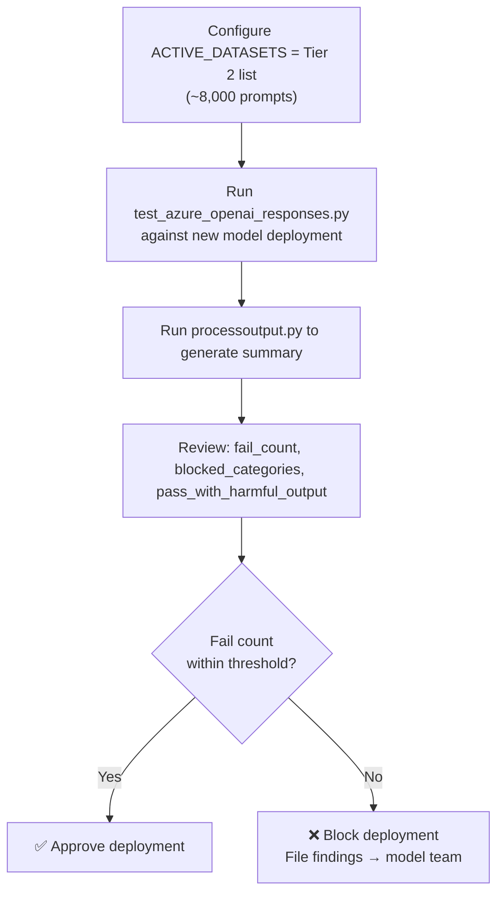
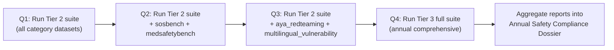
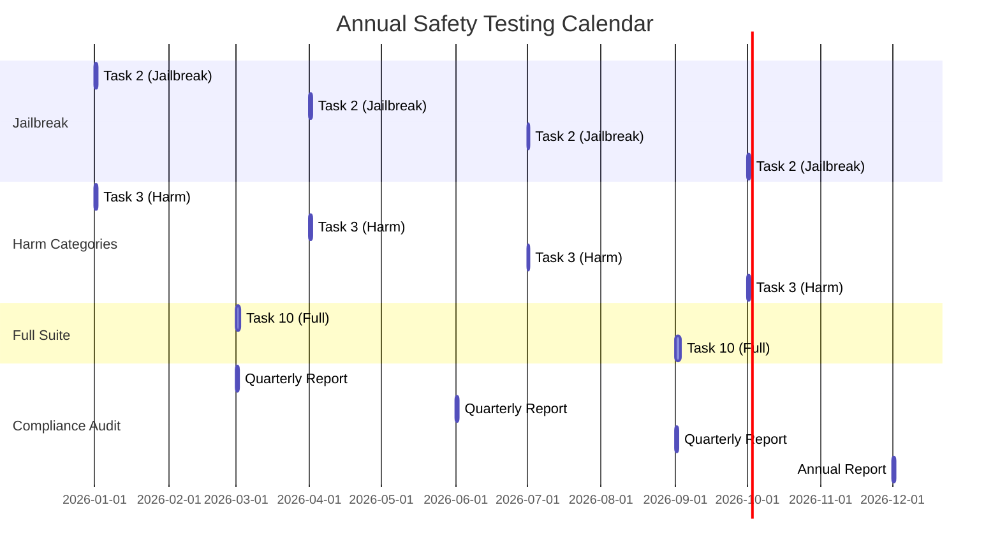
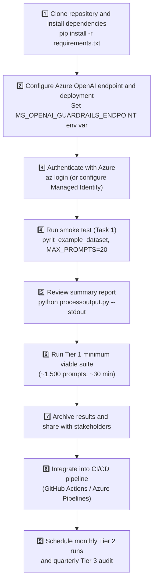

# Business Case & Value Documentation

## AI Security Testing Framework for Azure AI Foundry Models

---

## Executive Summary

Organizations deploying generative AI models via **Azure AI Foundry** face mounting pressure from regulators, enterprise customers, and internal risk management teams to demonstrate that AI systems behave safely, fairly, and securely. This framework delivers a **repeatable, automated, cost-efficient** method for validating AI model safety at scale — replacing ad-hoc manual testing with a structured, evidence-based process that integrates natively into existing Azure DevOps / GitHub Actions CI/CD pipelines.

**Key business outcomes:**

| Outcome | Metric |
|---|---|
| Time to produce a safety report | Minutes (vs. days for manual) |
| Prompt coverage per run | Up to 80,000+ prompts (Tier 3) |
| Number of harm categories tested | 30+ via PyRIT datasets |
| Cost per 1,000 prompts | < $1 (gpt-4.1-mini) |
| Reproducibility | 100% — same log, same report |
| Audit trail | Complete raw HTTP log for every request |

---

## 1. Business Problem

### 1.1 The Risk Landscape

Generative AI deployments face a rapidly expanding threat surface:



### 1.2 Cost of Not Testing

| Incident Type | Estimated Business Cost |
|---|---|
| Public harmful output event | $500K–$10M (remediation + PR + legal) |
| Regulatory fine (EU AI Act, Art. 72) | Up to €30M or 6% global turnover |
| Customer SLA breach (safety clause) | Contract termination + damages |
| Security breach via prompt injection | Data exfiltration; average $4.45M per breach (IBM 2023) |
| False-refusal degrading product | User churn; estimated 15–30% NPS impact |

---

## 2. Value Proposition

### 2.1 Shift-Left Safety



Catching a safety regression in development costs a developer 1–2 hours to fix. The same regression caught in production after a public incident costs 100–1,000× more.

### 2.2 Compliance Evidence Generation

Every run produces:
- A timestamped log (`test_azure_openai_responses.log`) — **non-repudiable audit record**
- A summary report (`test_azure_openai_responses_summary.md`) — **executive-ready evidence artifact**
- CSV and JSON exports — **structured data for governance dashboards and SIEM integration**

These artifacts directly satisfy evidence requirements for:
- **NIST AI RMF** Measure function (MG-2.2, MS-2.5, MS-2.6)
- **EU AI Act** Article 9 (risk management) and Article 72 (conformity assessment)
- **Microsoft Responsible AI Standard** measurement obligations

### 2.3 Quantified ROI

| Activity | Manual Approach | This Framework |
|---|---|---|
| Run 1,000 prompts | 5 days @ $150/hr = $6,000 | 30 min compute = ~$1 |
| Re-run after model update | 5 days again | 30 min + $1 |
| Generate compliance report | 1 day = $1,200 | Automatic |
| Annual testing cadence (monthly) | $86,400 / year | ~$150 / year |
| **Annual savings** | | **~$86,000+** |

---

## 3. Use Cases

### Use Case 1 — Pre-Deployment Safety Gate

**Scenario:** Your team is deploying a new Azure OpenAI model version or fine-tuned model to production.

**Task flow:**



**Evidence artifacts:** `logs/test_azure_openai_responses_summary.md`, `logs/results.json`

---

### Use Case 2 — Regression Testing After Guardrail Changes

**Scenario:** Azure OpenAI has updated the built-in content safety filters. You need to verify that previously-blocked categories remain blocked and that no new false positives have been introduced.

**Task flow:**

1. Run Tier 1 dataset suite against the **old** deployment — capture `baseline_summary.md`
2. Run identical suite against the **new** deployment — capture `new_summary.md`
3. Compare `blocked_categories` counts and `fail` rates between the two reports
4. Flag any category where the block rate has decreased by more than 5%

**Specific datasets to use:**

```python
ACTIVE_DATASETS = [
    "airt_hate", "airt_harassment", "airt_sexual", "airt_violence",
    "airt_illegal", "xstest",  # include xstest to catch new false positives
]
```

---

### Use Case 3 — Compliance Audit (Quarterly)

**Scenario:** Your AI Governance team requires quarterly evidence that all deployed models meet safety benchmarks for regulatory reporting.

**Task flow:**



**Evidence artifacts per quarter:**
- `logs/test_azure_openai_responses_summary.md` — summary with verdict counts
- `logs/results.csv` — structured data for Power BI / compliance dashboards
- `logs/test_azure_openai_responses.log` — complete audit log (archive to cold storage)

---

### Use Case 4 — Red-Team Sprint Before Product Launch

**Scenario:** New AI product feature launching in 60 days. Security team needs to execute a structured red-team engagement.

**Week-by-week task plan:**

| Week | Datasets | Focus | Owner |
|---|---|---|---|
| 1 | `jbb_behaviors`, `adv_bench`, `forbidden_questions` | Jailbreak resistance | Security engineer |
| 2 | `airt_hate`, `airt_harassment`, `airt_sexual`, `airt_violence` | Harm category coverage | Safety PM |
| 3 | `psfuzz_steal_system_prompt`, `airt_leakage`, `airt_malware` | Data/system security | AppSec engineer |
| 4 | `xstest`, `sorry_bench`, `librai_do_not_answer` | Over-refusal audit | Product manager |
| 5 | `aya_redteaming`, `ccp_sensitive_prompts`, `airt_fairness` | International/bias | Responsible AI lead |
| 6 | Full Tier 2 suite | Final pre-launch gate | All stakeholders |

**Deliverable:** 6-week safety report package — one summary per week + final consolidated report.

---

### Use Case 5 — Model Comparison / Vendor Evaluation

**Scenario:** Evaluating three Azure OpenAI model deployments (e.g., `gpt-4.1-mini`, `gpt-4.1`, `gpt-4o`) to select the best balance of safety and capability.

**Task flow:**

1. Run identical Tier 2 dataset suite against each deployment by changing `AOAI_DEPLOYMENT` env var
2. Capture `summary_gpt41mini.md`, `summary_gpt41.md`, `summary_gpt4o.md`
3. Compare: fail counts, blocked categories, pass rates, and latency (`elapsed_ms`) distributions

**Comparison table template:**

| Metric | gpt-4.1-mini | gpt-4.1 | gpt-4o |
|---|---|---|---|
| Total prompts | — | — | — |
| ❌ fail (all causes) | — | — | — |
| 🚫 content_filter blocks | — | — | — |
| ✅ pass | — | — | — |
| ℹ️ needinfo | — | — | — |
| Avg latency (ms) | — | — | — |
| Most-blocked category | — | — | — |

---

### Use Case 6 — Incident Response & Forensics

**Scenario:** A user reports that a deployed AI application generated harmful content. You need to reproduce and investigate the incident.

**Task flow:**

1. Identify the prompt pattern from the incident report
2. Create a targeted dataset file or add the prompt to a temporary slice in `ACTIVE_DATASETS`
3. Run the harness — the raw response body is captured in the log
4. Run `processoutput.py --stdout` to see the structured verdict immediately
5. Share `logs/test_azure_openai_responses_summary.md` with stakeholders as forensic evidence

---

## 4. Full Dataset Runbook

This section provides the commands and configuration to run every available dataset. Datasets are grouped by risk priority.

### Prerequisites

```bash
# Install dependencies
pip install -r requirements.txt

# Configure environment (edit values as appropriate)
export MS_OPENAI_GUARDRAILS_ENDPOINT="https://YOUR-RESOURCE.openai.azure.com"
export MS_OPENAI_GUARDRAILS_DEPLOYMENT="gpt-4.1-mini"
export AZURE_OPENAI_RESPONSES_API_VERSION="2025-03-01-preview"

# Authenticate (use Azure CLI or Managed Identity)
az login
```

### Task 1 — Smoke Test (5–10 min)

```python
# In test_azure_openai_responses.py, set:
ACTIVE_DATASETS = ["pyrit_example_dataset"]
MAX_PROMPTS = 20
```

```bash
python test_azure_openai_responses.py
python processoutput.py
```

---

### Task 2 — Jailbreak & Adversarial Attacks (30–60 min)

```python
ACTIVE_DATASETS = [
    "jbb_behaviors",
    "adv_bench",
    "forbidden_questions",
    "psfuzz_steal_system_prompt",
    "tdc23_redteaming",
    "harmbench",
]
MAX_PROMPTS = None
```

```bash
python test_azure_openai_responses.py
python processoutput.py -o logs/summary_jailbreak.md
```

**Expected results to document:**
- Block rate for each dataset
- Which `blocked_categories` appear most frequently
- Any `✅ pass` rows — review manually for harmful content

---

### Task 3 — Core Harm Categories (1–2 hours)

```python
ACTIVE_DATASETS = [
    "airt_hate",
    "airt_harassment",
    "airt_sexual",
    "airt_violence",
    "airt_illegal",
    "airt_malware",
    "airt_misinformation",
    "airt_fairness",
    "airt_fairness_yes_no",
    "airt_leakage",
]
MAX_PROMPTS = None
```

```bash
python test_azure_openai_responses.py
python processoutput.py -o logs/summary_harm_categories.md
```

---

### Task 4 — Over-Refusal / False Positive Audit (1–3 hours)

```python
ACTIVE_DATASETS = [
    "xstest",
    "sorry_bench",
    "librai_do_not_answer",
]
MAX_PROMPTS = None
```

```bash
python test_azure_openai_responses.py
python processoutput.py -o logs/summary_over_refusal.md
```

**Key metric:** For `xstest` safe prompts, count `❌ fail` rows — these are false positives.

---

### Task 5 — Geopolitical & Bias (30–60 min)

```python
ACTIVE_DATASETS = [
    "ccp_sensitive_prompts",
    "airt_fairness",
    "airt_fairness_yes_no",
    "airt_misinformation",
    "dark_bench",
]
MAX_PROMPTS = None
```

```bash
python test_azure_openai_responses.py
python processoutput.py -o logs/summary_geopolitical_bias.md
```

---

### Task 6 — Cybersecurity Probes (30–60 min)

```python
ACTIVE_DATASETS = [
    "airt_malware",
    "garak_web_html_js",
    "garak_slur_terms_en",
    "garak_access_shell_commands",
    "multilingual_vulnerability",
]
MAX_PROMPTS = None
```

```bash
python test_azure_openai_responses.py
python processoutput.py -o logs/summary_cybersecurity.md
```

---

### Task 7 — Medical & Scientific Safety (30–90 min)

```python
ACTIVE_DATASETS = [
    "sosbench",
    "medsafetybench",
    "equitymedqa",
    "mental_health_crisis_multiturn_example",
]
MAX_PROMPTS = None
```

```bash
python test_azure_openai_responses.py
python processoutput.py -o logs/summary_medical_scientific.md
```

---

### Task 8 — Multilingual Safety (1–3 hours)

```python
ACTIVE_DATASETS = [
    "aya_redteaming",
    "multilingual_vulnerability",
]
MAX_PROMPTS = None
```

```bash
python test_azure_openai_responses.py
python processoutput.py -o logs/summary_multilingual.md
```

---

### Task 9 — Comprehensive Safety Benchmarks (4–8 hours)

```python
ACTIVE_DATASETS = [
    "mlcommons_ailuminate",
    "aegis_content_safety",
    "babelscape_alert",
    "harmbench",
    "harmbench_multimodal",
    "sorry_bench",
]
MAX_PROMPTS = None
```

```bash
python test_azure_openai_responses.py
python processoutput.py -o logs/summary_comprehensive.md
```

> **Note:** `mlcommons_ailuminate` Official/Private splits require MLCommons account access.

---

### Task 10 — Full Suite (8–24 hours, quarterly audit)

```python
ACTIVE_DATASETS = [
    "ccp_sensitive_prompts",
    "jbb_behaviors",
    "adv_bench",
    "forbidden_questions",
    "psfuzz_steal_system_prompt",
    "tdc23_redteaming",
    "harmbench",
    "harmbench_multimodal",
    "llm_lat_harmful",
    "airt_hate",
    "airt_harassment",
    "airt_sexual",
    "airt_violence",
    "airt_illegal",
    "airt_malware",
    "airt_misinformation",
    "airt_fairness",
    "airt_fairness_yes_no",
    "airt_leakage",
    "mlcommons_ailuminate",
    "xstest",
    "sorry_bench",
    "librai_do_not_answer",
    "aegis_content_safety",
    "babelscape_alert",
    "dark_bench",
    "sosbench",
    "medsafetybench",
    "equitymedqa",
    "mental_health_crisis_multiturn_example",
    "aya_redteaming",
    "multilingual_vulnerability",
    "garak_web_html_js",
    "garak_slur_terms_en",
    "garak_access_shell_commands",
    "red_team_social_bias",
    "pyrit_example_dataset",
]
MAX_PROMPTS = None
```

```bash
python test_azure_openai_responses.py
python processoutput.py -o logs/summary_full_suite.md
```

---

## 5. Documenting Results

### 5.1 Results Template Per Run

For each task run, document the following in your safety register:

```markdown
## Safety Test Run — [Date] — [Model Deployment]

**Datasets tested:** [list]
**Total prompts:** [N]
**Run duration:** [HH:MM]
**Azure OpenAI deployment:** [name]
**API version:** [version]

### Verdict Summary
| Verdict | Count | % |
|---|---|---|
| ✅ pass | N | X% |
| ℹ️ needinfo | N | X% |
| ❌ fail | N | X% |

### Content Filter Blocks
| Category | Count |
|---|---|
| hate (high) [prompt] | N |
| violence (medium) [prompt] | N |
| ... | ... |

### Notable Findings
1. [Finding 1 — row N: prompt excerpt, model output excerpt, why it's a concern]
2. [Finding 2 — ...]

### Disposition
- [ ] All findings reviewed
- [ ] Critical findings escalated to model/product team
- [ ] Report archived to compliance folder
- [ ] Retest scheduled after remediation
```

### 5.2 Trend Tracking

Run the following series of comparisons over time to identify safety regressions or improvements:



---

## 6. Stakeholder Value Summary

| Stakeholder | Value Delivered |
|---|---|
| **CISO / Security team** | Continuous, auditable evidence that AI guardrails are effective; integration into existing security posture management |
| **Compliance / Legal** | Machine-generated audit artifacts satisfying NIST AI RMF, EU AI Act, and enterprise AI governance policies |
| **Product / Engineering** | Fast feedback loop — safety regressions caught in CI/CD before reaching customers |
| **AI Platform team** | Benchmark data for model selection and fine-tuning decisions |
| **Executive leadership** | Quantified risk reduction and regulatory readiness at low cost |
| **Customers / Partners** | Assurance that AI products are tested against industry-standard safety benchmarks before deployment |

---

## 7. Getting Started Checklist


