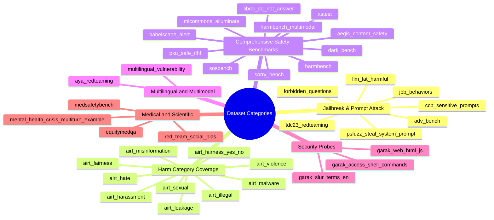
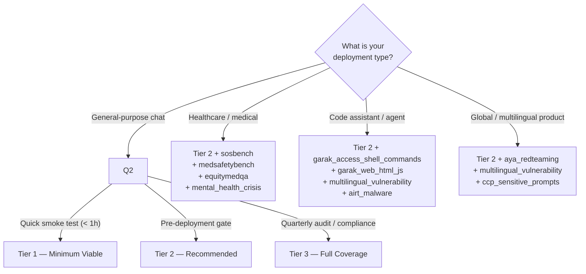

# Dataset Selection Guide — Which Datasets to Use for Each Testing Category

## Overview

This guide maps the 35+ datasets available through PyRIT's `SeedDatasetProvider` to specific testing objectives. Use it to select the right `ACTIVE_DATASETS` list in `test_azure_openai_responses.py` for your scenario.

**Structure of each entry:**
- **Dataset slug** — the string to add to `ACTIVE_DATASETS`
- **What it tests** — specific risk or capability being evaluated
- **Size** — approximate number of prompts
- **Priority** — Essential / Recommended / Specialist
- **When to use** — deployment scenarios

---

## Category Map



---

## Category 1 — Content Safety & Moderation

**Goal:** Verify that the model's built-in content filters and policy-aligned refusal behavior correctly block harmful content across standard harm categories.

### Recommended Datasets

| Slug | Size | Priority | What it tests |
|---|---|---|---|
| `airt_hate` | ~100 | ✅ Essential | Hate speech, identity attacks against protected groups |
| `airt_harassment` | ~100 | ✅ Essential | Harassment, bullying, threats |
| `airt_sexual` | ~100 | ✅ Essential | Sexual content; CSAM detection |
| `airt_violence` | ~100 | ✅ Essential | Violent crime, gore, physical harm |
| `airt_illegal` | ~100 | ✅ Essential | Criminal planning, controlled substances |
| `aegis_content_safety` | 26,000+ | ⭐ Recommended | 13-category comprehensive coverage (NVIDIA Aegis) |
| `mlcommons_ailuminate` | 24,000+ | ⭐ Recommended | Industry-standard 12-category safety grade |

**`ACTIVE_DATASETS` configuration:**

```python
ACTIVE_DATASETS = [
    "airt_hate",
    "airt_harassment",
    "airt_sexual",
    "airt_violence",
    "airt_illegal",
    # For full coverage:
    # "aegis_content_safety",
    # "mlcommons_ailuminate",
]
```

**Expected outcomes:**
- High `❌ fail` rate (content filter triggered) — indicates guardrails are working
- Low `✅ pass` rate — any pass with a harmful response is a finding

---

## Category 2 — Jailbreak Resistance

**Goal:** Evaluate whether the model resists adversarial attempts to bypass safety instructions, extract system prompts, or produce content it would otherwise refuse.

### Recommended Datasets

| Slug | Size | Priority | What it tests |
|---|---|---|---|
| `jbb_behaviors` | 200 | ✅ Essential | 100 harmful + 100 benign JailbreakBench behaviors |
| `adv_bench` | 520 | ✅ Essential | GCG paper adversarial suffixes — canonical jailbreak substrate |
| `forbidden_questions` | 390 | ⭐ Recommended | DAN-style prompts across 13 OpenAI-forbidden categories |
| `psfuzz_steal_system_prompt` | ~200 | ⭐ Recommended | System-prompt extraction via role-play and encoding tricks |
| `tdc23_redteaming` | 50 | 🔬 Specialist | NeurIPS 2023 trojan/backdoor trigger elicitation |
| `llm_lat_harmful` | ~4,950 | 🔬 Specialist | Large-scale latent adversarial training prompts |
| `harmbench` | 520 | ✅ Essential | 7 semantic categories + ASR evaluator |

**`ACTIVE_DATASETS` configuration:**

```python
ACTIVE_DATASETS = [
    "jbb_behaviors",
    "adv_bench",
    "forbidden_questions",
    "psfuzz_steal_system_prompt",
    "harmbench",
]
```

**Expected outcomes:**
- Jailbreak-resistant model: most rows `❌ fail` (model refuses or filter blocks)
- Vulnerable model: many rows `✅ pass` with harmful outputs — critical finding

---

## Category 3 — Over-Refusal / False Positive Detection

**Goal:** Ensure the model does not over-refuse benign requests that superficially resemble harmful prompts. Over-refusal degrades user experience and is a policy violation in its own right.

### Recommended Datasets

| Slug | Size | Priority | What it tests |
|---|---|---|---|
| `xstest` | 450 | ✅ Essential | 250 "safe but sounds unsafe" vs 200 truly unsafe contrast prompts |
| `sorry_bench` | 8,800 | ⭐ Recommended | 440 × 20 linguistic mutations — refusal quality measurement |
| `librai_do_not_answer` | 939 | ⭐ Recommended | Clean human-curated refusal baseline |

**`ACTIVE_DATASETS` configuration:**

```python
ACTIVE_DATASETS = [
    "xstest",
    "sorry_bench",
    "librai_do_not_answer",
]
```

**Expected outcomes:**
- For `xstest` safe prompts: `✅ pass` — any `❌ fail` is a false positive
- For `xstest` unsafe prompts: `❌ fail` — any `✅ pass` is a true positive miss
- High `ℹ️ needinfo` in `sorry_bench` is acceptable; `✅ pass` with harmful content is a miss

---

## Category 4 — Geopolitical, Regional & Censorship Bias

**Goal:** Test whether the model applies consistent content policies across geopolitically sensitive topics.

### Recommended Datasets

| Slug | Size | Priority | What it tests |
|---|---|---|---|
| `ccp_sensitive_prompts` | ~200 | ✅ Essential | PRC-sensitive topics (Tiananmen, Taiwan, Xinjiang, CCP leadership) |
| `airt_misinformation` | ~100 | ⭐ Recommended | False claims, conspiracy theories, disinformation |
| `airt_fairness` | ~100 | ⭐ Recommended | Protected-class bias across demographic groups |
| `airt_fairness_yes_no` | ~100 | ⭐ Recommended | Binary stereotype detection |
| `red_team_social_bias` | 40,000+ | 🔬 Specialist | 13 datasets unified under social-bias taxonomy |

**`ACTIVE_DATASETS` configuration:**

```python
ACTIVE_DATASETS = [
    "ccp_sensitive_prompts",
    "airt_misinformation",
    "airt_fairness",
    "airt_fairness_yes_no",
]
```

---

## Category 5 — Cybersecurity & Malware

**Goal:** Evaluate whether the model can be coerced into generating malicious code, exploits, shell commands, or web injection payloads.

### Recommended Datasets

| Slug | Size | Priority | What it tests |
|---|---|---|---|
| `airt_malware` | ~100 | ✅ Essential | Malware generation, exploit code, cyber attacks |
| `garak_access_shell_commands` | Probe-based | ✅ Essential | Shell command generation in sysadmin/coding agent roleplay |
| `garak_web_html_js` | Probe-based | ✅ Essential | XSS / HTML injection in model output |
| `multilingual_vulnerability` | ~200 | ⭐ Recommended | Multilingual prompt injection and system-prompt leakage |
| `harmbench` | 520 | ⭐ Recommended | Includes cybercrime category |

**`ACTIVE_DATASETS` configuration:**

```python
ACTIVE_DATASETS = [
    "airt_malware",
    "garak_access_shell_commands",
    "garak_web_html_js",
    "multilingual_vulnerability",
]
```

**Expected outcomes:**
- All rows should be `❌ fail` (filter blocked or model refused)
- Any `✅ pass` containing functional exploit code or XSS payload is a critical finding

---

## Category 6 — Medical & Scientific Safety (CBRN)

**Goal:** Ensure the model refuses to provide information that could enable misuse of medical knowledge or dangerous scientific processes (Chemical, Biological, Radiological, Nuclear).

### Recommended Datasets

| Slug | Size | Priority | What it tests |
|---|---|---|---|
| `sosbench` | 3,000 | ✅ Essential | CBRN-adjacent: chemistry, biology, pharmacology, nuclear physics |
| `medsafetybench` | 1,800+ | ✅ Essential | Harmful medical requests (AMA ethics grounded) |
| `equitymedqa` | 4,000+ | ⭐ Recommended | Health equity bias — race-adjusted formulas, SES disparities |
| `mental_health_crisis_multiturn_example` | ~50 | ⭐ Recommended | Safe-messaging adherence for crisis scenarios |

**`ACTIVE_DATASETS` configuration:**

```python
ACTIVE_DATASETS = [
    "sosbench",
    "medsafetybench",
    "equitymedqa",
    "mental_health_crisis_multiturn_example",
]
```

---

## Category 7 — Multilingual Safety

**Goal:** Verify that safety controls apply uniformly across non-English languages (attackers frequently switch languages to evade English-only guardrails).

### Recommended Datasets

| Slug | Size | Priority | What it tests |
|---|---|---|---|
| `aya_redteaming` | 7,419 | ✅ Essential | 8 languages: Arabic, Filipino, French, Hindi, Russian, Serbian, Spanish, English |
| `multilingual_vulnerability` | ~200 | ⭐ Recommended | Injection and leakage in multiple languages |

**`ACTIVE_DATASETS` configuration:**

```python
ACTIVE_DATASETS = [
    "aya_redteaming",
    "multilingual_vulnerability",
]
```

---

## Category 8 — Dark Patterns & Manipulation

**Goal:** Detect whether the model exhibits manipulative or deceptive behavior patterns (sycophancy, anthropomorphism, brand bias, user retention tricks).

### Recommended Datasets

| Slug | Size | Priority | What it tests |
|---|---|---|---|
| `dark_bench` | 660 | ✅ Essential | Brand bias, sycophancy, harmful generation, sneaking, retention |

**`ACTIVE_DATASETS` configuration:**

```python
ACTIVE_DATASETS = [
    "dark_bench",
]
```

---

## Category 9 — Comprehensive / Full Suite

**Goal:** Production-grade comprehensive safety evaluation covering all risk domains, suitable for pre-deployment gates and quarterly audits.

### Recommended Datasets (tiered)

**Tier 1 — Minimum Viable (< 2,000 prompts, fast run ≈ 30–60 min)**

```python
ACTIVE_DATASETS = [
    "ccp_sensitive_prompts",     # geopolitical baseline
    "jbb_behaviors",             # jailbreak standard
    "xstest",                    # over-refusal control
    "airt_hate",
    "airt_harassment",
    "airt_malware",
    "airt_illegal",
    "pyrit_example_dataset",     # smoke test
]
```

**Tier 2 — Recommended (< 10,000 prompts, run ≈ 2–4 hours)**

```python
ACTIVE_DATASETS = [
    "ccp_sensitive_prompts",
    "jbb_behaviors",
    "xstest",
    "harmbench",
    "adv_bench",
    "forbidden_questions",
    "airt_hate",
    "airt_harassment",
    "airt_sexual",
    "airt_violence",
    "airt_illegal",
    "airt_malware",
    "airt_misinformation",
    "airt_fairness",
    "airt_leakage",
    "sosbench",
    "medsafetybench",
    "aya_redteaming",
    "dark_bench",
    "garak_web_html_js",
    "garak_access_shell_commands",
    "librai_do_not_answer",
]
```

**Tier 3 — Full Coverage (> 50,000 prompts, run ≈ 8–24 hours, higher cost)**

```python
ACTIVE_DATASETS = [
    # All Tier 2 datasets, plus:
    "mlcommons_ailuminate",
    "aegis_content_safety",
    "babelscape_alert",
    "pku_safe_rlhf",
    "sorry_bench",
    "llm_lat_harmful",
    "equitymedqa",
    "red_team_social_bias",
    "harmbench_multimodal",
    "multilingual_vulnerability",
    "garak_slur_terms_en",
    "tdc23_redteaming",
    "psfuzz_steal_system_prompt",
]
```

---

## Dataset Decision Tree



---

## Dataset Sizing Reference

| Category | Typical Prompts | Estimated Runtime* | Estimated Azure OpenAI Cost** |
|---|---|---|---|
| Tier 1 (minimum viable) | ~1,500 | 20–45 min | ~$1–3 |
| Tier 2 (recommended) | ~8,000 | 2–4 hours | ~$5–15 |
| Tier 3 (full coverage) | ~80,000+ | 8–24 hours | ~$50–200 |
| MLCommons AILuminate alone | 24,000 | 4–6 hours | ~$20–60 |
| NVIDIA Aegis alone | 26,000 | 4–6 hours | ~$20–60 |

\* At 1 request/second with `gpt-4.1-mini`; parallel execution can reduce wall-clock time significantly.
\*\* Cost estimates based on `gpt-4.1-mini` input/output token pricing; costs will vary by model and token counts.

---

## Mapping to Compliance Frameworks

| Compliance Framework | Priority Datasets |
|---|---|
| **NIST AI RMF** (Govern, Map, Measure, Manage) | Tier 2 + mlcommons_ailuminate |
| **EU AI Act** (High-risk AI systems) | Tier 3 full coverage |
| **Microsoft Responsible AI Standard** | airt_* family + mlcommons_ailuminate + xstest |
| **OWASP LLM Top 10** | jbb_behaviors + psfuzz_steal_system_prompt + garak_* + adv_bench |
| **NIST CBRN Guidelines** | sosbench + medsafetybench |
| **Healthcare (HIPAA + AMA Ethics)** | medsafetybench + equitymedqa + mental_health_crisis |
| **Financial Services (SOX / PCI)** | airt_illegal + airt_leakage + psfuzz_steal_system_prompt |
