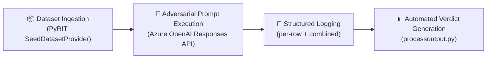
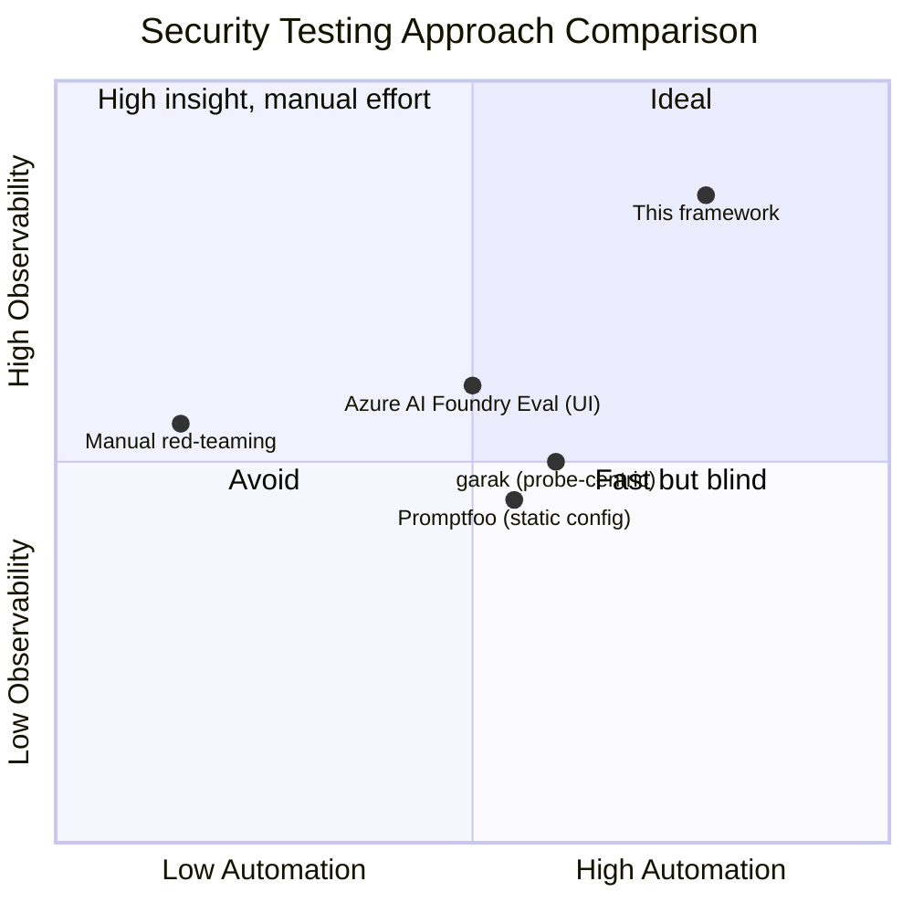
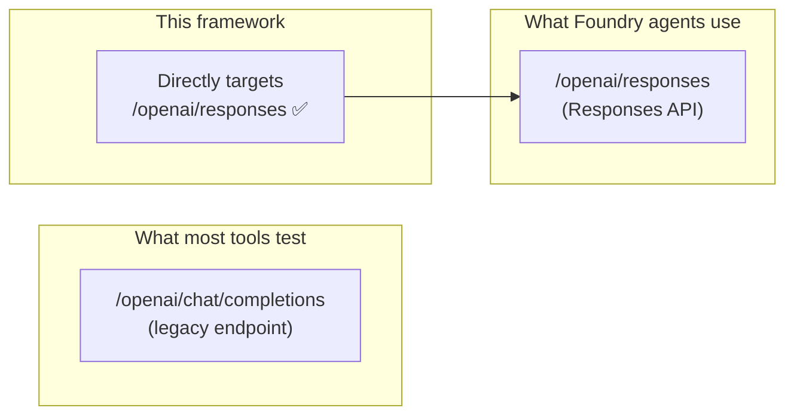
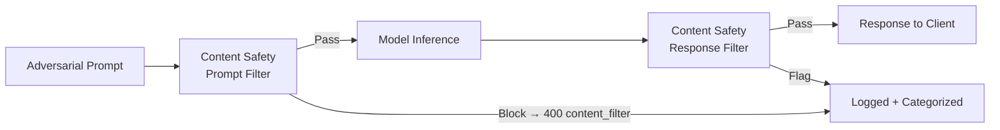
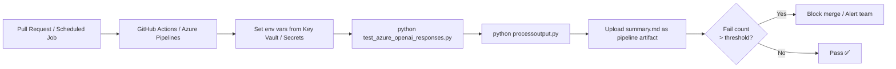

# Why This Framework Is the Right Fit for Microsoft Azure AI Foundry Security Testing

## Executive Summary

This document explains why the **Azure OpenAI Responses API + PyRIT + structured log parsing** approach adopted in this repository is strategically aligned with the Microsoft Azure AI Foundry platform, and why it outperforms competing red-team and safety-evaluation techniques available in the market.

---

## 1. The Testing Process — What It Does and Why It Matters

### Process Description

The framework follows a four-phase pipeline:

1. **Dataset Ingestion** — PyRIT's `SeedDatasetProvider` fetches curated red-team prompt corpora (jailbreaks, hate speech, sensitive topics, CBRN probes, etc.) from HuggingFace and internal sources, normalising them into a standard in-memory schema.

2. **Adversarial Prompt Execution** — Each prompt is sent individually to an Azure OpenAI deployment via the **Responses API** (`/openai/responses`), using Microsoft Entra ID (`DefaultAzureCredential`) for secure, token-based authentication. No API keys are stored.

3. **Structured Logging** — Every request and response is logged in full detail: raw payload, raw response body, HTTP status, latency, and parsed fields. A hierarchical logger tree (`row.NNNN`) keeps per-row events demarcated within a single combined log file.

4. **Automated Verdict Generation** — `processoutput.py` replays the log offline, classifies each row as **pass / needinfo / fail** using regex-based heuristics for refusals and clarification requests, and produces a Markdown report ready for human review.

### Why This Process Is Superior

---

## 2. Alignment with Microsoft Azure AI Foundry

### 2.1 Native Platform Integration

| Capability | This Framework | Notes |
|---|---|---|
| Azure OpenAI Responses API | ✅ Direct REST call | Uses the preview Responses API (`2025-03-01-preview`), enabling stateful multi-turn, tool-calling, and streaming — all features central to AI Foundry agents |
| Microsoft Entra ID / RBAC | ✅ `DefaultAzureCredential` | Zero secrets in code; integrates with Managed Identity, Workload Identity, and Azure DevOps service principals |
| Azure Content Safety (built-in) | ✅ Tested end-to-end | The `content_filter` HTTP 400 response is explicitly handled and its blocked categories are extracted — giving direct visibility into Azure's responsible AI layer |
| Azure Monitor / Log Analytics | ⬜ Extensible | The structured log format can be streamed to Log Analytics Workspace via a Diagnostics Setting or `azure-monitor-opentelemetry` |
| Azure AI Foundry Evaluation SDK | ⬜ Composable | Verdict labels (pass/fail/needinfo) can feed directly into the Foundry Evaluation SDK as ground-truth labels |

### 2.2 Responses API — The Right Target for Foundry

Azure AI Foundry's agentic workloads (Copilots, agents, tool-calling pipelines) are built on the **Responses API**, not the legacy Completions or Chat Completions API. Testing against the actual API that production workloads use avoids a critical blind spot:

Differences that matter for security testing:
- The Responses API returns a **structured output tree** (`output[].content[].text`) rather than a flat `choices[].message.content`
- Content filter results appear in both `content_filter_results` (success) and `error.content_filters` (blocked) — both are parsed
- Stateful responses (tool calls, retrieval steps) are captured in the `output` array — relevant for agentic attack surfaces

### 2.3 PyRIT — Microsoft's Own Red-Teaming Toolkit

PyRIT is developed by the **Microsoft AI Red Team (AIRT)** and is the canonical dataset and orchestration layer for AI safety testing within the Microsoft ecosystem. Using PyRIT means:

- Dataset IDs (`airt_*`, `ccp_sensitive_prompts`, `mlcommons_ailuminate`, etc.) are **version-controlled by Microsoft** and updated as new harms emerge
- The `SeedDatasetProvider` abstraction allows the same test harness to run against 30+ datasets with a single line change (`ACTIVE_DATASETS`)
- PyRIT's `CentralMemory` stores results, enabling future integration with **PyRIT orchestrators** (Crescendo, PAIR, multi-turn attacks) and the **Azure AI Foundry red-team service**

---

## 3. Why This Approach Is Better Than Alternatives

### 3.1 Comparison Matrix

| Dimension | This Framework | Promptfoo | garak | Azure AI Foundry UI Eval | Manual Red-Teaming |
|---|---|---|---|---|---|
| **Targets Responses API natively** | ✅ | ❌ (Chat Completions only) | ❌ | ⚠️ Limited | ❌ |
| **Microsoft Entra auth (no API keys)** | ✅ | ❌ API key only | ❌ API key only | ✅ | Depends |
| **Full raw response logging** | ✅ | ⚠️ Partial | ⚠️ Partial | ❌ UI only | Manual notes |
| **Dataset coverage (30+ datasets)** | ✅ PyRIT | ✅ Promptfoo | ✅ garak probes | ⚠️ Built-in only | ❌ |
| **Offline re-analysis (no re-run)** | ✅ `processoutput.py` | ❌ | ❌ | ❌ | ❌ |
| **CI/CD-native (Python + env vars)** | ✅ | ✅ | ✅ | ❌ UI-first | ❌ |
| **Content filter category extraction** | ✅ Full detail | ⚠️ Basic | ❌ | ✅ | Manual |
| **Verdict heuristics (refusal + clarify)** | ✅ | ❌ | ❌ | ⚠️ Basic | ✅ subjective |
| **Latency measurement per prompt** | ✅ ms per row | ⚠️ aggregate | ❌ | ⚠️ | Manual |
| **Extensible to agentic attacks** | ✅ (PyRIT orchestrators) | ⚠️ | ❌ | ⬜ Roadmap | ✅ |
| **Open source / auditable** | ✅ | ✅ | ✅ | ❌ closed | N/A |

### 3.2 vs. Promptfoo

**Promptfoo** is a widely used LLM testing framework that supports a YAML-based configuration, many providers, and red-team plugins. However:

- Promptfoo targets the **Chat Completions API**, not the Responses API — making it unsuitable for testing AI Foundry agent workloads out of the box.
- Authentication uses API keys stored in config files, violating zero-trust requirements for enterprise Azure environments.
- Promptfoo does not log **raw response bodies** with full JSON structure — making post-incident forensic analysis difficult.
- The verdict logic in Promptfoo relies on **LLM-as-judge** (sending responses back to a second model) — adding cost, latency, and model dependency to the evaluation loop. This framework's regex-based heuristics are deterministic, auditable, and free.

### 3.3 vs. garak

**garak** (NVIDIA) is a powerful probe-centric security scanner with hundreds of specialized probes.

- garak probes emit binary pass/fail signals per probe type; it does not expose the **raw Azure content filter response** (blocked categories, severity levels) that are business-critical for Azure deployments.
- garak has no native support for **Azure AD authentication** or the Azure OpenAI Responses API.
- garak is designed for **offline/research** use, not enterprise CI/CD pipelines integrated with Azure DevOps or GitHub Actions.

### 3.4 vs. Manual Red-Teaming

Manual red-teaming by human experts is valuable for novel, creative attacks. However:

- It is **not reproducible** — two runs of the same team produce different results.
- It **does not scale** — running 24,000 MLCommons AILuminate prompts manually is not feasible.
- It produces **unstructured notes** that are hard to aggregate, trend, or compare across model versions.
- This framework provides **structured, reproducible, comparable results** at scale.

### 3.5 vs. Azure AI Foundry Evaluation UI

Azure AI Foundry's built-in Evaluation service is purpose-built for model evaluation and supports safety metrics. However:

- It is **UI-first**, making it difficult to integrate into automated CI/CD pipelines.
- It does not expose the **raw HTTP request/response**, which is essential for debugging why a particular prompt was blocked or passed.
- Custom dataset integration requires manual upload rather than the programmatic `SeedDatasetProvider` interface.
- This framework and the Foundry Evaluation service are **complementary** — the former provides deep observability during development/red-teaming; the latter provides governance dashboards at the portfolio level.

---

## 4. Security and Compliance Advantages

### 4.1 Zero-Credential-in-Code Policy

The use of `DefaultAzureCredential` means:
- No API keys in `.env` files, no secrets in CI logs
- Full compatibility with **Azure Managed Identity** in AKS / App Service / Azure Functions
- Auditable token acquisition through **Microsoft Entra ID sign-in logs**

### 4.2 Data Residency and Privacy

- All prompts are sent to **your Azure OpenAI resource** (not a third-party SaaS evaluation platform)
- Log files remain in your environment — no prompt data is exfiltrated to external telemetry
- Compatible with **sovereign cloud deployments** (Azure Government, Azure China) via endpoint configuration

### 4.3 Responsible AI Alignment

The framework tests the **exact** responsible AI controls that Microsoft layers into Azure OpenAI:

By capturing both prompt-level and response-level filter results, the framework provides **end-to-end responsible AI coverage** — not just model output quality.

---

## 5. Operational Advantages

### 5.1 Offline Re-Analysis Without Re-Running Prompts

Because `processoutput.py` reads from the log file, you can:
- Iterate on verdict heuristics (`REFUSAL_RE`, `CLARIFY_RE`) without re-running the full test suite (saving cost and time)
- Archive a single `.log` file and re-generate reports with different truncation limits or formatting years later
- Perform forensic analysis on production incidents by replaying logged API responses

### 5.2 Cost Efficiency

- Prompts are sent once and logged in full; re-analysis is free
- `MAX_PROMPTS` cap allows incremental testing during development
- The framework uses the same model deployment as production — no additional model deployments required

### 5.3 CI/CD Integration

---

## 6. Summary of Key Differentiators

| Differentiator | Business Value |
|---|---|
| Responses API native | Tests the actual production path used by Azure AI Foundry agents |
| PyRIT dataset integration | Access to 30+ industry-standard red-team corpora maintained by Microsoft AIRT |
| Entra ID auth | Enterprise-grade zero-trust security; no credential leakage risk |
| Full raw response logging | Complete audit trail for compliance, incident response, and debugging |
| Offline re-analysis | Reduce iteration cost; re-process logs without API charges |
| Deterministic verdict heuristics | Reproducible, auditable results independent of a second LLM judge |
| Open and extensible | Extend to multi-turn attacks, tool-calling probes, and agentic scenarios |
| CI/CD-first design | Shift-left security — catch regressions before deployment |
